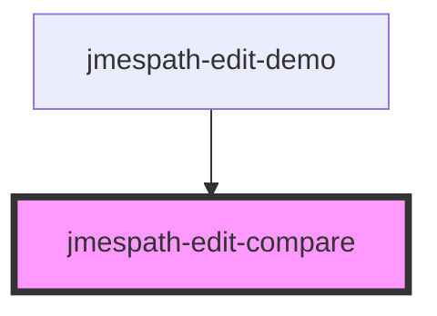

# jmespath-edit-compare

<!-- Auto Generated Below -->

## Properties

| Property     | Attribute    | Description | Type                                                                                     | Default                      |
| ------------ | ------------ | ----------- | ---------------------------------------------------------------------------------------- | ---------------------------- |
| `expression` | `expression` |             | `string`                                                                                 | `''`                         |
| `json`       | `json`       |             | `JSONValue[] \| boolean \| null \| number \| string \| { [member: string]: JSONValue; }` | `null`                       |
| `library`    | `library`    |             | `string`                                                                                 | `'@metrichor/jmespath-plus'` |

## Dependencies

### Used by

 - [jmespath-edit-demo](../jmespath-edit-demo)

### Graph

----------------------------------------------

*Built with [StencilJS](https://stenciljs.com/)*
